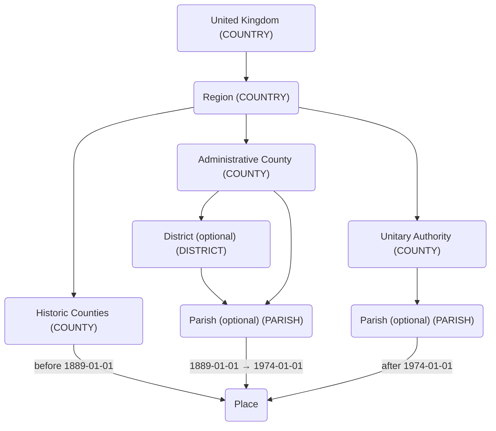

# Gazetteer of British Places Names (GBPN)

This **experimental** Gramplet adds support for importing data from the [Gazetteer of British Place Names](https://gazetteer.org.uk).

> [!Warning]
> This extension is experimental and may not work as expected. Use at your own risk.
> Please create a backup of your Gramps database before using any of these extensions.
>
> If you encounter any issues, please [create an issue](https://github.com/owenvoke/gramps-addons/issues/new?template=bug-report.yml&addon=GBPN) on the GitHub repository.

## Install

Download the [latest release](https://github.com/owenvoke/gramps-addons/tree/main/GBPN) and install it in Gramps.

This requires downloading the [GBPN data](https://gazetteer.org.uk/purchase) ([direct ZIP link](https://gazetteer.org.uk/GBPN.zip)) and storing the `GBPN.csv` file in the `GBPN` directory.

## Usage

1. Add the `GBPN` Gramplet in the Places tab of the Gramps UI.
2. Enter [the GBPN ID](https://gazetteer.org.uk/contents#column9) of the place you want to import.
3. Click the "Import place" button to import the new place.
4. Check that the items have been correctly imported.

### Configuration

The Gramplet has various configuration that can be managed in the `gbpn.ini` file in the plugins directory.

| Key                                     | Default | Description                                                       |
|-----------------------------------------|---------|-------------------------------------------------------------------|
| `preferences.alternative_names.enabled` | `True`  | Import alternative names.                                         |
| `preferences.hierarchy.enabled`         | `True`  | Import the place hierarchy.                                       |
| `preferences.strip_civil_parish_suffix` | `False` | Strip the `CP` suffix when importing Civil Parishes.              |
| `hierarchy.admin`                       | `True`  | Import the administrative area in the hierarchy.                  |
| `hierarchy.civil_parish`                | `True`  | Import the civil parish in the hierarchy.                         |
| `hierarchy.historic`                    | `True`  | Import the historic county in the hierarchy.                      |
| `hierarchy.modern`                      | `True`  | Import the modern area (e.g. unitary authority) in the hierarchy. |

### Hierarchy

By default, the Gramplet will import the hierarchy with the following structure:

## Notes

- `Place` entities in Gramps do not currently support attributes, which means that the imported places rely on a specifically named URL to match updates.
